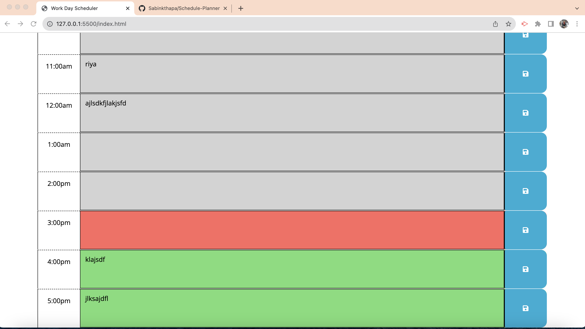
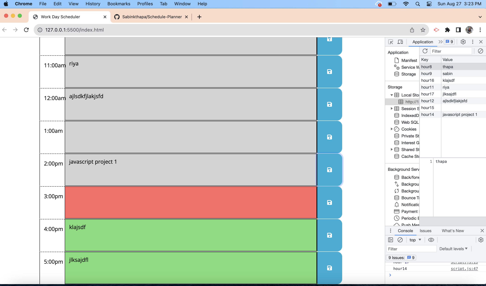

# Daily Schedule Planner
    
## This simple application demonstrates how to create a simple work day schedule planner which uses dayjs to handle the time. The application allow user to enter the text and save to the localStorage.The color of green ,red , light -brown shows future , current and past hours.

- Reason for this Project: To help user to understand how could we use jquery ,bootstrap ,googlefont to build a simple application.

- Problem this project solved : This simple application would provide ideas to generate and widen the skills for bigger web applications.

## usage 

Some working application shots of this schedule planner:

## Deployment Link

-Please check the deloyed link below:
